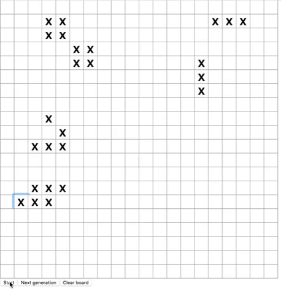

### Game of Life
Simple React app for Conway's Game of Life

#### Rules:
1. Any live cell with fewer than two live neighbors dies, as if by under population.
2. Any live cell with two or three live neighbors lives on to the next generation.
3. Any live cell with more than three live neighbors dies, as if by overpopulation.
4. Any dead cell with exactly three live neighbors becomes a live cell, as if by reproduction.

For more context on Conway's Game of Life: [Wikipedia](https://en.wikipedia.org/wiki/Conway%27s_Game_of_Life)

### How to Start App
- Run `npm install` to install all node modules
- Run `npm start` to start app
- Visit `localhost:3000` to use app

### Features
As of 2018/09:
- Start and stop auto-playthrough of generations
- Step through next generations upon button click
- Clear board

Potential features:
- Change board size
- Change interval timing

### Notes
This project was bootstrapped with [Create React App](https://github.com/facebookincubator/create-react-app).
